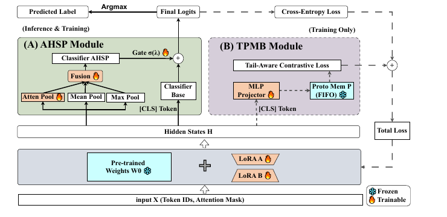
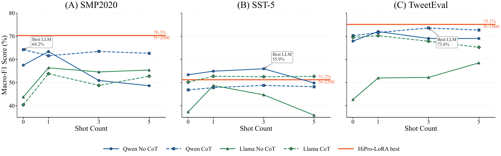
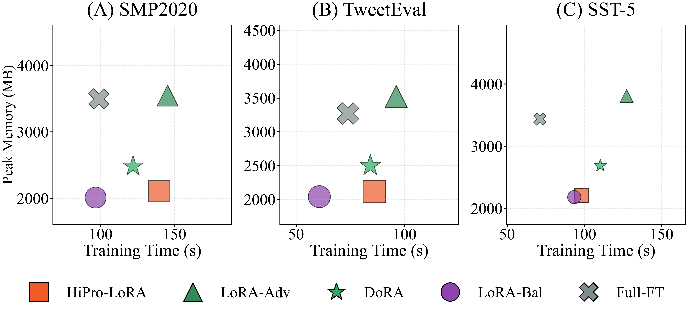
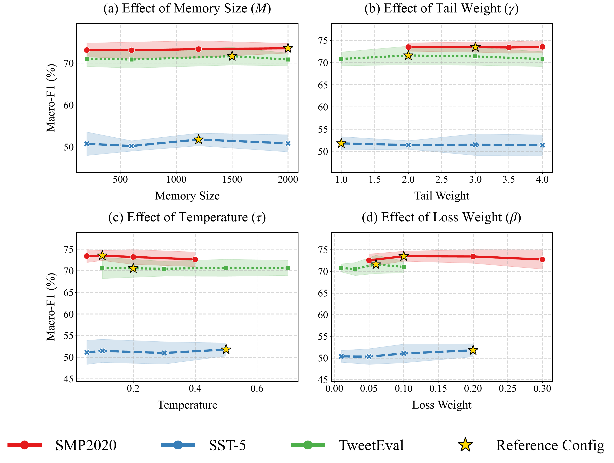
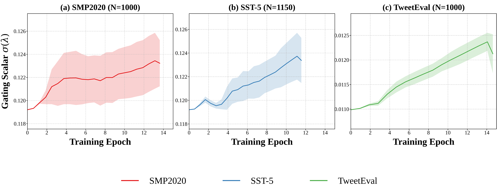

# HiPro-LoRA：低资源长尾情感分析的层次化原型 LoRA

HiPro-LoRA 是面向低资源、长尾分布情感分析的参数高效微调框架，论文已被 **ECML-PKDD** 接收并提交最终版。ECML-PKDD 是机器学习与知识发现方向的重要国际会议，国内通常按 **CCF B 类会议** 识别。

这个项目解决的问题很具体：在标注数据少、类别分布长尾的场景下，普通 LoRA 很容易优先拟合头部类别，尾部类别的特征空间被挤压，最终表现为 Macro-F1 不稳定、Tail-F1 明显塌缩。HiPro-LoRA 在 LoRA 的轻量训练优势上加入两个结构化模块：**AHSP 多视图层次池化** 和 **TPMB 尾部原型记忆库**，让轻量 encoder 在尾部类别上获得更稳定的判别边界。



## 一句话概括

在严格 held-out test 协议下，HiPro-LoRA 在 6 个低资源长尾配置中取得 **5 个 Tail-F1 最优** 和 **4 个 Macro-F1 最优**；在 SMP2020-EWECT 上相对最强 Qwen2.5-7B few-shot 行取得 **+6.08 Macro-F1**，说明经过结构化正则的 110M 级 encoder 在垂直长尾任务上可以比通用 7B LLM 更高效、更可复现。

内部实验名 `LoRA-Ours` 对应论文方法名 `HiPro-LoRA`。

## 为什么普通 LoRA 不够

低资源长尾情感分析同时卡在两个地方：

| 难点 | 普通做法的问题 | HiPro-LoRA 的处理 |
| --- | --- | --- |
| 单一 `[CLS]` 表示容量不足 | LoRA 的低秩更新容易把细粒度情绪压进头部类别空间 | AHSP 从 attention / mean / max 三个视角融合 hidden states，补足单向量瓶颈 |
| 尾部类别跨 batch 样本少 | 单个 mini-batch 难以形成稳定类中心，尾部梯度容易被淹没 | TPMB 为每个类别维护 FIFO 原型队列，并对尾部类别加权对比约束 |
| 损失函数重加权不稳定 | Focal / LDAM / Logit Adjustment 只在损失层处理不平衡，不能直接修复表示空间 | 把类别不平衡问题下沉到特征几何层，直接约束尾部类间距 |
| LLM few-shot 成本高 | 7B 模型提示推理耗显存、吞吐低，且输出格式需要解析 | 110M 级 encoder 可部署为普通分类器，输出稳定，延迟低 |

## 方法结构

### AHSP：Adaptive Hierarchical State Pooling

AHSP 不只使用最后一层 `[CLS]`，而是从 hidden states 中构造三类互补视图：

| 视图 | 作用 |
| --- | --- |
| Attention Pool | 抓取情绪关键词、否定词、强语气表达 |
| Mean Pool | 平滑短文本中的局部噪声，保留整体语义 |
| Max Pool | 保留高强度情绪激活，适合捕获少数类显著信号 |

三路表示经过 bottleneck MLP 对齐后，与基础分类头通过可学习 gate 融合。这个设计的价值在于：它不依赖增大 backbone，而是用结构化表示融合扩大低资源场景下的有效特征带宽。

### TPMB：Tail-aware Prototype Memory Bank

TPMB 是训练期模块，推理期不保留。它把 `[CLS]` 特征投影到低维单位球面，为每个类别维护跨 batch FIFO 队列，并用尾部加权对比损失拉近同类样本、推远异类样本。

这个模块重点解决 mini-batch 里尾部样本太少的问题。相比只在当前 batch 内做 SupCon，TPMB 能跨 batch 看到更多尾部邻居；相比普通 prototype 方法，它不要求额外数据初始化原型，适合低资源实验。

## 主实验结果

下表来自 `code/Table2_summary.md`，所有指标均为 5 个固定随机种子的 mean ± std，最终分数在 disjoint class-balanced held-out test subset 上报告。

| 数据集 / 配置 | 关键对比 | Macro-F1 | Tail-F1 |
| --- | --- | --- | --- |
| SMP2020 A / N=1000 | LoRA-Vanilla | 58.97 ± 1.88 | 40.86 ± 3.62 |
| SMP2020 A / N=1000 | DoRA-Balanced | 69.10 ± 2.37 | 59.27 ± 4.94 |
| SMP2020 A / N=1000 | LoRA-Adv | 69.11 ± 2.51 | 59.51 ± 4.50 |
| SMP2020 A / N=1000 | **HiPro-LoRA** | **69.93 ± 1.36** | **61.61 ± 4.07** |
| TweetEval A / N=1000 | LoRA-Vanilla | 70.78 ± 1.16 | 72.93 ± 1.19 |
| TweetEval A / N=1000 | DoRA-Balanced | 73.42 ± 2.25 | 77.98 ± 1.76 |
| TweetEval A / N=1000 | LoRA-Adv | 73.43 ± 3.04 | 78.46 ± 3.14 |
| TweetEval A / N=1000 | **HiPro-LoRA** | **75.11 ± 2.59** | **79.39 ± 2.73** |
| SST-5 A / N=1150 | LoRA-Vanilla | 33.77 ± 2.48 | 17.29 ± 5.85 |
| SST-5 A / N=1150 | DoRA-Balanced | 45.47 ± 1.05 | 43.05 ± 4.13 |
| SST-5 A / N=1150 | LoRA-Focal | 47.20 ± 1.65 | 43.75 ± 4.24 |
| SST-5 A / N=1150 | **HiPro-LoRA** | **47.78 ± 2.18** | **44.12 ± 1.35** |

更完整的 6 组配置结果见 [code/Table2_summary.md](code/Table2_summary.md)。

## 代表性提升

| 对比对象 | 数据集 / 配置 | 提升点 |
| --- | --- | --- |
| 相比 LoRA-Vanilla | SST-5 A | Macro-F1 **+14.01**，Tail-F1 **+26.83** |
| 相比 LoRA-Vanilla | SMP2020 A | Macro-F1 **+10.96**，Tail-F1 **+20.75** |
| 相比 DoRA-Balanced | TweetEval A | Macro-F1 **+1.69**，Tail-F1 **+1.41** |
| 相比 LoRA-Adv | TweetEval A | Macro-F1 **+1.68**，Tail-F1 **+0.93** |
| 相比 Qwen2.5-7B best strict row | SMP2020 | Macro-F1 **+6.08** |

这些差距说明 HiPro-LoRA 的提升不是单纯依赖 class weight，也不是 DoRA 或 adversarial training 的替代调参，而是来自“多视图表示扩展 + 尾部原型几何约束”的组合。

## LLM 对比



LLM baseline 使用 Qwen2.5-7B-Instruct 和 Llama-3.1-8B-Instruct-bnb-4bit，在同一 balanced held-out test subset 上做 0/1/3/5-shot、CoT / No-CoT 对照。核心结论是：

| 数据集 | HiPro-LoRA best | Best strict LLM | 差距 |
| --- | --- | --- | --- |
| SMP2020 | 70.32 | 64.24 / Qwen Zero-Shot CoT | **+6.08** |
| SST-5 | 51.23 | 55.94 / Qwen 3-Shot No-CoT | -4.71 |
| TweetEval | 75.11 | 73.57 / Qwen 3-Shot CoT | **+1.54** |

这组结果的意义不是宣称小模型全面替代 LLM，而是说明：在专业、固定标签、长尾分布明显的情感任务中，结构化 PEFT 往往比直接提示 7B 通用模型更稳、更便宜。

## 效率与可解释性图表







图表说明：

| 图 | 对应文件 | 说明 |
| --- | --- | --- |
| LLM comparison | `code/Figure3_llm_comparison_data.md` | 对比 HiPro-LoRA 与 Qwen / Llama few-shot |
| Efficiency | `code/Figure4_efficiency_data.md` | 训练时间、峰值显存、Macro-F1 三维对照 |
| Sensitivity | `code/Figure5_sensitivity_data.md` | Memory Size、Tail Weight、Temperature、Loss Weight 敏感性 |
| Gate dynamics | `code/Figure2_gate_dynamics_data.md` | 训练过程中 gate 对 AHSP 分支的动态依赖 |

## 消融实验

细粒度消融来自 [code/Table3_final.md](code/Table3_final.md)。几个关键观察：

| 数据集 / 配置 | Full | 去掉 AHSP | 去掉 Memory | 结论 |
| --- | --- | --- | --- | --- |
| SST-5 A | 47.78 | 45.34 | 46.89 | AHSP 和 TPMB 都有收益 |
| TweetEval A | 75.11 | 73.07 | 72.58 | 两个模块共同提升稳定性 |
| SMP2020 A | 69.93 | 68.87 | 67.74 | 原型记忆对中文长尾尾部类更关键 |
| SST-5 B | 51.23 | 23.76 | 50.56 | 去掉 AHSP 后方差显著放大，说明单一 `[CLS]` 在细粒度情感上不稳定 |

## 实验协议

本仓库强调严格评测口径：

| 项目 | 设置 |
| --- | --- |
| 数据集 | SMP2020-EWECT、SST-5、TweetEval |
| Backbone | `hfl/chinese-macbert-base`、`roberta-base` |
| PEFT | LoRA r=16, alpha=32, dropout=0.1 |
| 种子 | 45, 123, 789, 1001, 2024 |
| 模型选择 | validation split 只用于 early stopping 和 checkpoint selection |
| 最终报告 | disjoint class-balanced held-out test subset |
| 对照方法 | Full FT、LoRA、LoRA-Balanced、DoRA-Balanced、LoRA-Adv、Focal、LDAM、Logit Adjustment、Qwen/Llama few-shot |

## 仓库结构

```text
.
├── README.md
├── docs/assets/                    # README 可预览图
└── code/
    ├── run_scripts/                # 统一运行入口
    ├── table2_strict/              # 主实验严格 held-out 结果
    ├── table3_strict/              # AHSP / TPMB 细粒度消融
    ├── sensitivity_gate_strict/    # 敏感性分析与 gate 动态
    ├── llm_baselines/              # Qwen / Llama few-shot baseline
    ├── figures/                    # 论文图表 PDF
    ├── Table2_summary.md
    ├── Table3_final.md
    ├── Figure3_llm_comparison_data.md
    ├── Figure4_efficiency_data.md
    └── Figure5_sensitivity_data.md
```

## 运行方式

生成论文图：

```bash
cd code
python run_scripts/run_figures.py
```

复现完整严格实验：

```bash
cd code
python run_scripts/run_all.py
```

按实验组单独运行：

```bash
python run_scripts/run_table2_strict.py
python run_scripts/run_table3_strict.py
python run_scripts/run_sensitivity_gate_strict.py
```

多 GPU 调度：

```bash
export HIPRO_RUN_GPUS=0,1,2,3
export HIPRO_RUN_GPU_SLOTS=0:2,1:2,2:3,3:3
```

## 结果文件

```text
code/table2_strict/results/*_table2_strict_results.csv
code/table3_strict/results/*_table3_strict_results.csv
code/sensitivity_gate_strict/results/*_sensitivity.csv
code/llm_baselines/few_shot_results/llm_fewshot_results.csv
```

## 项目状态

- 论文状态：ECML-PKDD 已接收，最终版已提交；
- 代码状态：严格评测包、图表脚本、LLM baseline 和结果数据已整理；
- 许可协议：MIT License。
